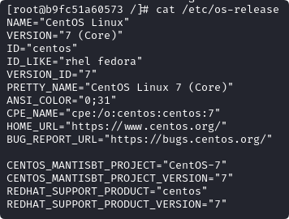

### 安装docker

---

#### centos

1. 首先确定centos内核版本是3.10以上，3.8以上貌似也可以

   1. uname -r查看内核版本

   2. 小tips：

      yum update : 升级所有包同时也升级软件和系统内核

      yum upgrade : 只升级所有包，不升级软件和系统内核

   3. 如果之前安装过的话，需要卸载旧版本
   	
   	```
   	yum remove docker docker-common docker-selinux docker-engine
   	```

2. 安装Docker-CE的基本环境，yum-util 提供yum-config-manager功能，另两个是devicemapper驱动依赖
  ```
  yum install -y yum-utils device-mapper-persistent-data lvm2
  ```

3. 设置yum源
  ```
  顺便设置好yum源
  ①备份：sudo mv /etc/yum.repos.d/CentOS-Base.repo /etc/yum.repos.d/CentOS-Base.repo.backup
  ②下载国内源的 YUM 配置文件：
  	阿里云：sudo wget -O /etc/yum.repos.d/CentOS-Base.repo http://mirrors.aliyun.com/repo/Centos-7.repo或使用curl
  	清华：sudo wget -O /etc/yum.repos.d/CentOS-Base.repo https://mirrors.tuna.tsinghua.edu.cn/repo/Centos-7.repo
  ③清理 YUM 缓存：
  	sudo yum clean all
  	sudo yum makecache
  ④检验：sudo yum repolist
  yum-config-manager --add-repo http://mirrors.aliyun.com/docker-ce/linux/centos/docker-ce.repo
  ```

4. 选择docker版本并安装
  1. 查看可以版本有哪些
      ```
      yum list docker-ce --showduplicates | sort -r
      ```

  2. 选择一个版本安装
      ```
      yum install docker-ce-版本号
      ```
      

  🌟可以直接安装默认版本（推荐）

  ```
  yum update -y
  yum install docker-ce docker-ce-cli containerd.io
  ```

5. 设置开机自启
  ```
  systemctl enable docker
  systemctl dsiable docker
  ```

6. docker常用命令
  1. 启动、关闭、重启docker
      ```
      systemctl start docker
      systemctl stop docker
      systemctl restart docker
      ```

  2. 查看docker状态、信息

      ```
      systemctl status docker	#查看docker服务状态 running 就是启动成功
      docker info 	#更新docker加速源后可以查看是否成功，检查Registry Mirrors:
      ```

  3. 其他

     ```
     #镜像命令
     docker images：列出所有镜像
     docker search [image]：搜索 Docker 镜像
     docker pull [image]：拉取指定镜像
     docker rmi [image]：删除指定镜像
     #容器命令
     docker ps：列出当前所有正在运行的容器
     docker ps -a：列出所有容器，包括已经停止的容器
     docker create [image]：创建一个新的容器，但不启动它
     docker start [container]：启动一个容器
     docker stop [container]：停止一个容器
     docker rm [container]：删除一个容器
     docker exec -it [container] [command]：在运行中的容器中执行命令
     #其他命令
     docker info：显示 Docker 系统信息
     docker version：显示 Docker 版本信息
     docker logs [container]：查看容器的日志
     docker network ls：列出 Docker 网络
     docker network create [network]：创建一个新的 Docker 网络
     docker network connect [network] [container]：将容器连接到指定的 Docker 网络
     docker network disconnect [network] [container]：将容器从指定的 Docker 网络中断开连接 
     ```

7. 设置docker加速源

   ```
   mkdir -p /etc/docker	#修改(创建)目录
   vi /etc/docker/daemon.json	#编辑、创建/etc/docker/daemon.json文件
   ```

   ```
   {
     "registry-mirrors": [
   	"https://docker.1ms.run",
   	"https://hub.geekery.cn",
   	"https://dockerpull.com",
   	"https://docker.1panel.dev"
   ]
   }
   ```

   ```
   systemctl daemon-reload 	#任何时候你修改了systemd管理的服务的配置文件，都应该执行systemctl daemon-reload来确保更改被正确加载。
   systemctl restart docker	#然后重启对应服务(docker)
   ```

8. 测试

   ```
   docker run hello-world
   ```

   

#### kali linux

1. 更新系统和换源

   1. ```
      apt-get update
      apt-get upgrade
      ```

   2. ```
      cp /etc/apt/sources.list /etc/apt/sources.list.backup
      vim /etc/apt/sources.list 	#或者使用nano工具，如果你使用的是 nano，按 Ctrl + X，然后按 Y 确认保存更改，最后按 Enter 键退出。
      ```

   3. ```
      deb http://mirrors.tuna.tsinghua.edu.cn/kali kali-rolling main non-free contrib
      deb-src http://mirrors.tuna.tsinghua.edu.cn/kali kali-rolling main non-free contrib
      
      deb http://mirrors.tuna.tsinghua.edu.cn/kali-security kali-rolling/updates main contrib non-free
      deb-src http://mirrors.tuna.tsinghua.edu.cn/kali-security kali-rolling/updates main contrib non-free
      
      deb http://mirrors.tuna.tsinghua.edu.cn/kali kali-rolling/updates main non-free contrib
      deb-src http://mirrors.tuna.tsinghua.edu.cn/kali kali-rolling/updates main non-free contrib
      ```

2. 安装docker

   ````
   sudo apt-get update
   sudo apt-get install docker.io
   ````

3. 检查

   ```
   docker -v
   或docker version
   ```

4. 启动、设置自启动

   ```
   systemctl start docker
   systemctl enable docker
   ```

5. 配置中国镜像源
   ```
   mkdir -p /etc/docker	#修改(创建)目录
   vim /etc/docker/daemon.json	#编辑、创建/etc/docker/daemon.json文件
   ```

   ```
   {
     "registry-mirrors": [
   	"https://docker.1ms.run",
   	"https://hub.geekery.cn",
   	"https://dockerpull.com",
   	"https://docker.1panel.dev"
   ]
   }
   ```

   ```
   systemctl daemon-reload 	#任何时候你修改了systemd管理的服务的配置文件，都应该执行systemctl daemon-reload来确保更改被正确加载。
   systemctl restart docker	#然后重启对应服务(docker)
   ```

6. 检查 Docker 服务的运行状态

   ```
   systemctl status docker.service
   ```

   
   
   导入容器：docker run -it --name my_centos7 centos:7 /bin/bash或者docker pull centos:7
   
   - `docker run`：这是Docker CLI（命令行界面）用来创建并启动一个新的容器的命令。
   
   - `-it`：这是两个参数的组合，`-i`（或`--interactive`）保持容器的标准输入（STDIN）打开，即使不附加到容器终端，`-t`（或`--tty`）分配一个伪终端。这两个参数一起使用，可以让你与容器内运行的进程进行交互。
   
     **`-d` 参数代表“detached”模式，即 *分离模式*  或  *后台模式* 。当你使用 `docker run -d` 来启动一个容器时，容器会在后台运行，并且你将立即返回到命令行界面，而不是保持与容器的交互式会话。**
   
   - `-name my_centos7`：这个参数为新创建的容器指定一个名称，这里是`my_centos7`。
   
   - `centos:7`：这是Docker镜像的名称和标签，指定了要使用的镜像。在这里，使用的是CentOS 7的官方镜像。
   
   - `/bin/bash`：这是容器启动后要执行的命令，这里是启动bash shell。
   
   
   
   后续运行centos7容器：
   
   ```
   docker start my_centos7 	#开启
   docker exec -it my_centos7 bash 	#运行容器
   docker stop my_centos7 	#关闭
   ```
   
   cat /etc/os-release 
   
   
   
   导入方法2：
   
   ```
   docker load -i xx.tar
   ```
   
   ```
   如果这个images用的很多，可以 sudo docker save -o xxx.tag centos:7   这样就可以把images保存在当前目录xxx.tag，然后把镜像可以复制到物理机(可能没权限复制，改个权限就可以)。
   
   如果下次重新装了kali，docker装好的情况下，把物理机的images复制进来，用sudo docker load -i xxx.tag 
   这样就不用再用 docker pull 拉了。
   ```
   

#### 容器与云

创建Apache容器后台运行

```
docker container run -d --rm -p 8080:80 httpd 	#拉取httpd镜像
curl localhost:8080 	#有回显标签就说明安装成功
```

#### docker常用命令

container有时候可以省略

```
docker container ls 	#查看正在运行的容器
docker ps -a 	#查看所以已创建的容器
docker top <names or container id> 	#查看特定容器的进程信息
docker exec -it <names or container id> /bin/bash 	#登录后台运行的容器
docker container stop <names or container id> 	#停止容器

docker container run -d --rm -p 8080:80 -v /home/user/webroot/:/usr/local/apache2/htdoces/ httpd
#挂载宿主机目录
--rm :设置容器退出时自动删除
```


